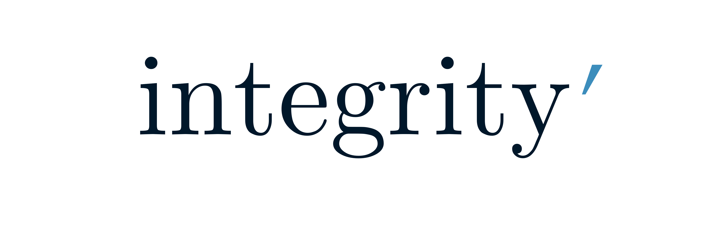
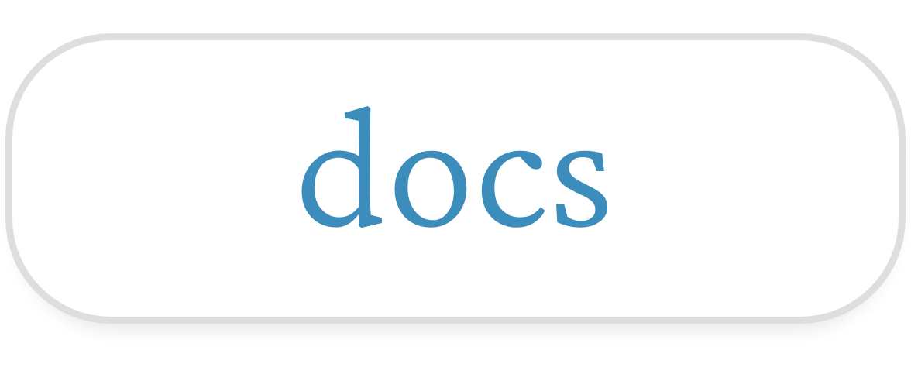
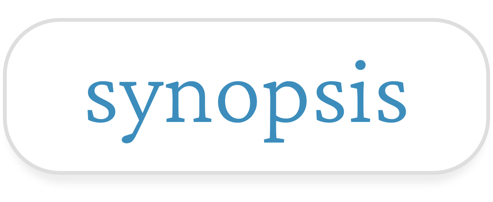
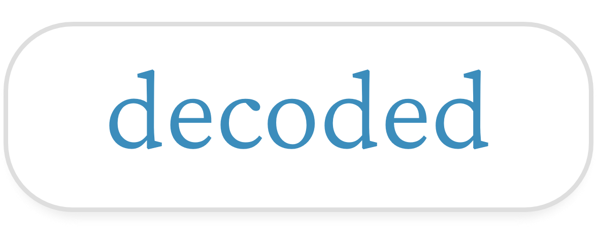

 

## Features

- Dozens of hand-crafted maths questions
- Question browser with hints and solutions
- Processing engine to extract questions from Markdown files

### Topics
- [Integration](https://sup2point0.github.io/integrity/integrals)
- [Completing the square](https://sup2point0.github.io/complete-square)
- [Graph drawing](https://sup2point0.github.io/graphs)
- [Addvent](https://sup2point0.github.io/addvent) (Christmas-themed questions)

 

## Credits

All questions in *Integrity* were hand-written by myself. Of course, maths is maths, so there is every possibility you may find a particular problem elsewhere too.

### AI
No AI was used for any of these!

(I should hope I am not that bad a mathematician...)

### License
MIT. Please use and distribute these questions however you like – maths is for everyone!

 
