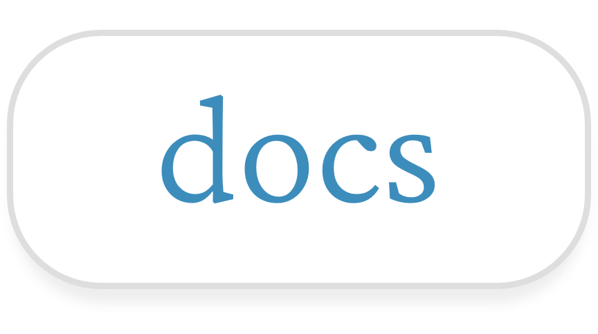

 

## Features

- Hundreds of hand-crafted maths questions
- Question browser with myriads of filters
- Hints, answers and solutions to every question
- Articles on mathematical topics
- Dynamic step-by-step walkthroughs

### Topics
- [Integration](https://sup2point0.github.io/integrity/questions/integrals)
- [Game Development in Desmos](https://sup2point0.github.io/integrity/desmos/gamedev)
- [Gradient Descent in Desmos](https://sup2point0.github.io/integrity/desmos/grad-desc) (coming soon!)
- [Graph Drawing](https://sup2point0.github.io/integrity/questions/graph-drawing)
- [Guess the Graph](https://sup2point0.github.io/integrity/questions/guess-graph)
- [Cool Graphs](https://sup2point0.github.io/integrity/questions/cool-graphs)
- [Completing the Square](https://sup2point0.github.io/integrity/questions/complete-square)
- [Addvent](https://sup2point0.github.io/integrity/questions/addvent)

### Tooling
- Parsing engine to extract questions and content from Markdown files
- Custom syntax for controlling Desmos embed from markup

 

## Preview

<table>
  <tr><td>
    
  </td></tr>
</table>

 

## Credits

All content in *Integrity* was created by myself.

Many thanks to everyone who’s helped find bugs, spot typos, and test new features! You know who you are ;)

### Contribute
*Integrity* is an independent project for my own maths questions, but I appreciate the sentiment! And if you just want to chat about maths, well, I’m always more than happy to do that >:)

### Licence
See [Licence](https://sup2point0.github.io/integrity/info/licence). CC BY-SA for the written content, MIT for the questions and source code.

 

---

[XKCD 2117](https://xkcd.com/2117)

 
