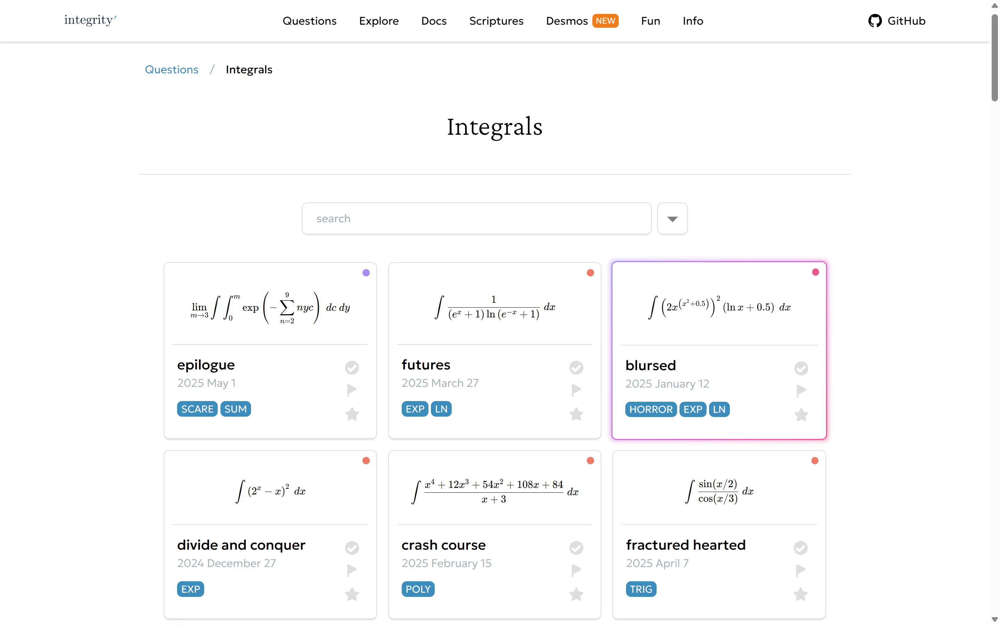

 

## Features

- Dozens of hand-crafted maths questions
- Question browser with hints and solutions
- Hand-crafted guides on mathematical topics
- Processing engine to extract questions from Markdown files

### Topics
- [Integration](https://sup2point0.github.io/integrity/questions/integrals)
- [Graph Drawing](https://sup2point0.github.io/integrity/questions/graph-drawing)
- [Completing the Square](https://sup2point0.github.io/integrity/questions/complete-square)
- [Guess the Graph](https://sup2point0.github.io/integrity/questions/guess-graph)
- [Addvent](https://sup2point0.github.io/questions/addvent) (Christmas-themed questions)
- [Desmos](https://www.desmos.com/)

### Upcoming
- Flag, mark as completed, and favourite questions, saved to local storage
- Speedrun environment for speedrunning questions

 

## Preview

<table>
  <tr><td>
    
  </td></tr>
</table>

 

## Credits

All questions in *Integrity* were created by myself. Of course, maths is maths, so there is every possibility a particular combination of expressions I’ve made has appeared a nonzero number of times elsewhere too. Some questions may also have been inspired by others I have encountered before.

### Contribute
*Integrity* is an independent project for my own maths questions, but I appreciate the sentiment! And if you just want to chat about maths, well, I’m always more than happy to do that >:)

### AI
No AI was used for any of these.

(I should hope I am not that bad a mathematician...)

### License
MIT. Please use and distribute these questions however you like – maths is for everyone!

 

---

[XKCD 2117](https://xkcd.com/2117)

 
