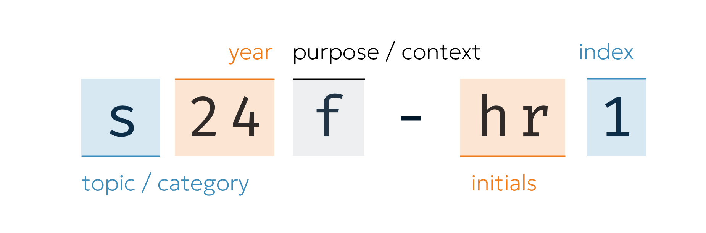

# Question Shards
<!-- #SQUARK live!
| dest = docs/shards
| title = Shards
| desc = Explaining the question identifier codes used throughout Integrity
| head = Shards
| capt = Question Identifier Codes
| index = docs
| update = 2025 July 10
| clean = line-breaks
-->

Each question I devise is designated its own unique identifier deemed a *shard*. They look like this:

```ruby
i24f-hr1
s25cu-dq4
```

All question shards are unique, even between topics. Shards are permanently assigned – a question’s shard will never change, even if other questions are added or deleted. They act as a compact and unambiguous way to identify questions.


<br>


## Format

The shard is a case-insensitive alphanumeric string, with a single hyphen and no whitespace. It comprises several identifying fields:



| field | notes | instance |
| :---- | :---- | :------- |
| Topic | The mathematical topic. | `i` |
| Year | The year of creation. | `24` |
| Purpose | The context(s) under which the problem was created. | `c` |
| | Hyphen for separating parts of the shard. | `-` |
| Initials | Initials relating to an aspect of the problem. | `hr` |
| Index | An integer for counting shards in case collisions occur. | `1` |

### Topic
Each shard is generally assigned a single topic.

| value | meaning | notes |
| :---- | :------ | :---- |
| `a` | arithmetic / algebra | |
| `e` | exponentials / logarithms | |
| `f` | graph drawing | |
| `g` | graph guessing | |
| `i` | complex numbers | |
| `n` | number theory / sequences | |
| `p` | combinatorics / probability | |
| `q` | completing the square / quadratic | |
| `r` | geometry | Needs to be ASCII-safe so can’t use $π$ :P |
| `s` | integration | `i` was taken by complex numbers, unfortunately. |
| `t` |  |  |
| `w` |  |  |
| `o` | miscellaneous / other | |

### Purpose
A question will often have several of these in its shard.

| value | meaning | notes |
| :---- | :------ | :---- |
| `c` | competition / event | |
| `f` | fun | |
| `p` | practice | |
| `u` | unused | |
